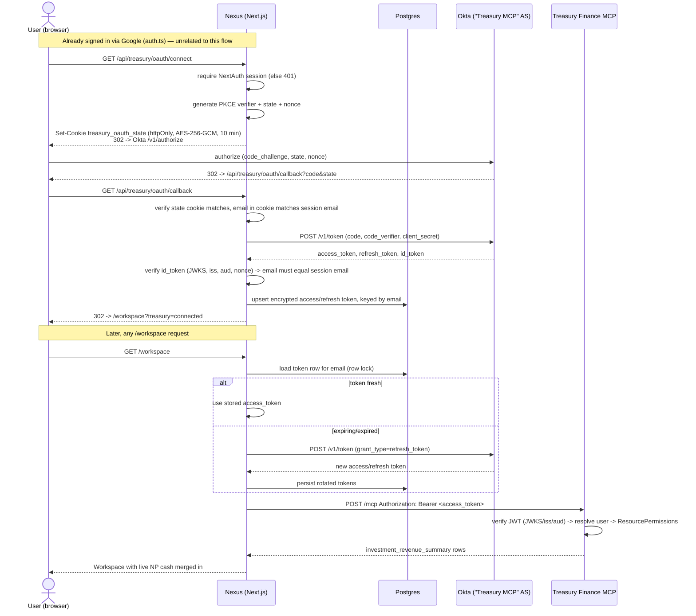
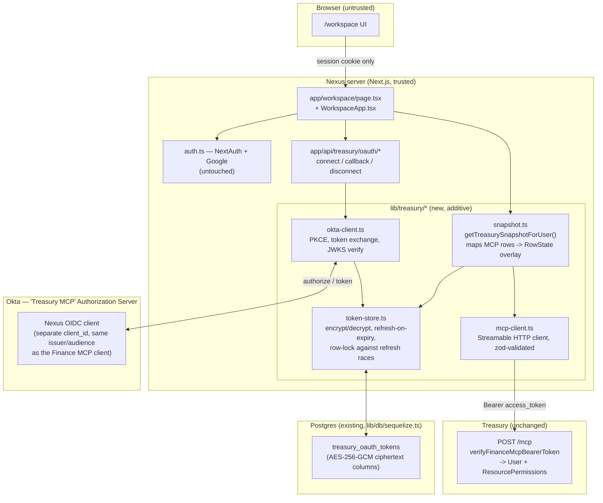
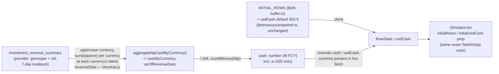

# Treasury OAuth (Okta) Integration — Architecture

> Companion to `.claude/rules/project/decisions.md`. Covers how Nexus connects
> to Treasury's Finance MCP server to pull live Notional Pool cash balances
> into the Workspace simulator, without touching the existing Google sign-in
> (`auth.ts`) or any of Kirill's FX engine code (`lib/dashboard-model.ts`,
> `lib/fx-buffer.ts`, `lib/test-mode/*`).

## Why a second auth flow

Nexus already gates `/workspace` behind NextAuth + Google (`auth.ts`) — that
answers "is this a Nexus user?". Getting *Treasury* data additionally
requires answering "does Treasury's own RBAC let this specific person see
this data?", which only Treasury can answer, via the same Okta-backed
Finance MCP OAuth flow already running in production for the MCP server
(Claude, Cursor, etc.). The two are independent and stack: a user signs into
Nexus with Google, then optionally "connects Treasury" from `/workspace` —
a second, additive OAuth round trip against a separate Okta OIDC client
registered under the **same** Okta Authorization Server ("Treasury MCP") the
Finance MCP server already verifies tokens against. Treasury requires zero
code changes: `verifyFinanceMcpBearerToken` checks token signature/issuer/
audience, never `client_id`, so a second registered client is
indistinguishable from the MCP one.

## 1. OAuth sequence

Tokens never reach the browser — only an opaque NextAuth session cookie
does. The Treasury access/refresh token pair lives exclusively in Postgres,
AES-256-GCM encrypted (`lib/treasury/crypto.ts`). The state cookie is
encrypted under the same `TOKEN_ENCRYPTION_KEY` but with a distinct AAD tag
(`AAD_OAUTH_STATE_COOKIE` vs `AAD_TREASURY_TOKEN`), so a leaked cookie value
can't be decrypted as if it were a stored token, or vice versa. All redirect
URIs are built from `AUTH_URL`, not the request's `Host` header, to avoid an
open redirect off these authenticated endpoints — required in production
(`treasuryCanonicalOrigin` throws rather than falling back to the
Host-derived origin when `NODE_ENV=production` and `AUTH_URL` is unset),
optional in local dev. The row lock in the diagram above is only taken when
a refresh is actually due — the common case (token nowhere near expiry)
reads without a lock or transaction at all. A refresh failure only drops
the stored link when Okta explicitly rejects it (`invalid_grant`); a
timeout or 5xx leaves the link intact and surfaces as a transient error.

## 2. Components and trust boundaries

No change to `helm/`, `.github/`, `argocd/`, `values.yaml`, or `Dockerfile` —
new secrets (`OKTA_ISSUER`, `OKTA_CLIENT_ID`, `OKTA_CLIENT_SECRET`,
`TREASURY_MCP_URL`, `TOKEN_ENCRYPTION_KEY`) flow in through the existing
AWS Secrets Manager entry `fx-test-project` → `ExternalSecret` → `envFrom`
wiring, same path Google's `AUTH_GOOGLE_*` already uses.

## 3. Data flow — MCP tool → `RowState` / `usdCash` field

Empty or unparseable results are **not** reported as `'live'` — if the tool
returns zero usable rows (feed outage, long weekend beyond the lookback
window), the snapshot falls back to the static book with `status: 'error'`
rather than a truthful-sounding "Treasury live · 0 ccy". `asOf` is the
**oldest** of the overlaid currencies' own latest `revenueDate` — a
deliberately conservative "as of", not the fetch's wall-clock time and not
the freshest date seen. Reporting the newest would let one fresh currency
(e.g. EUR, updated today) hide a laggard (e.g. RSD, last reported 6 days
ago but still inside the lookback window) behind a same-day timestamp; the
oldest-per-currency choice means `asOf` never overstates how fresh the
book actually is.

**Deliberately out of scope this iteration** — verified live against the
connected Treasury MCP, not assumed:

- `spot` / `fwd` (net FX book position): `fx_pl_report` returns cumulative
  P&L and trade-volume figures (`totalAmount` in the billions), not a net
  position — confirmed by a direct call, not a guess from the docs.
- `nonNpCash` (local books outside the NP): `check_all_rails` returns every
  operational account (`Pay In - Deel Inc`, `Pay Out - EOR`, `Client Money
  GP - PYG`, `Corporate Account`, `Investment - Short/Long term`, ...) with
  no field distinguishing "local funding cash" from the rest — summing it
  would silently produce a wrong number in a book this sensitive.
- `CURRENCY_PARAMS` (rates, spot FX): untouched by design — 11 golden-number
  test files in `lib/` assert against the current hardcoded JPM NP figures.

These fields keep their existing static values; the Workspace badge shows
`status: 'live'` with the count of currencies actually overlaid (including
whether the USD leg is live), never a blanket "connected" claim.
